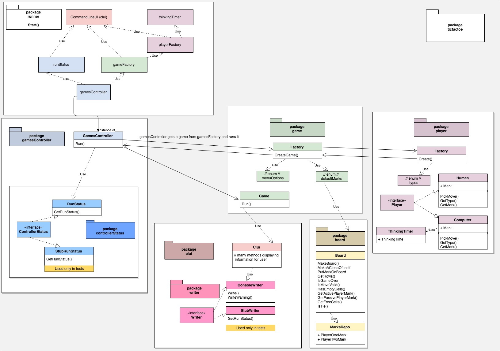

## Unbeatable Tic Tac Toe game in Go.

## Requirements
- golang version 1.11 (you can download go from [here](https://golang.org/dl/))

## How to run in
- clone this repository `git clone https://github.com/koszkota/tictactoe`
- `cd tictactoe`
- `export GOPATH=$HOME/path/to-tictactoe`
- run `echo $GOPATH` to check if the path is correct. I places the directory in root, and so the path for me was: `Users/<my_name>/tictactoe`
- run `go get github.com/logrunorgru/aurora` to get the dependency
- `go run Main.go`

## How to test it
In order to run all tests, go to the root directory and run: `$ go test ./...`
This command should run all tests in current directory and all of its subdirectories.
As a result, you'll see a list of directories marked as `ok` when they have tests or `?` in case of no test files.

## Packages diagram
